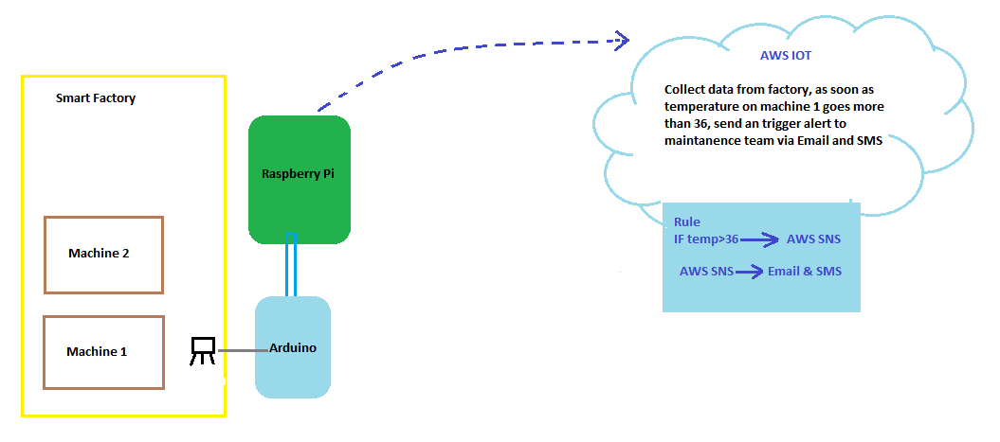
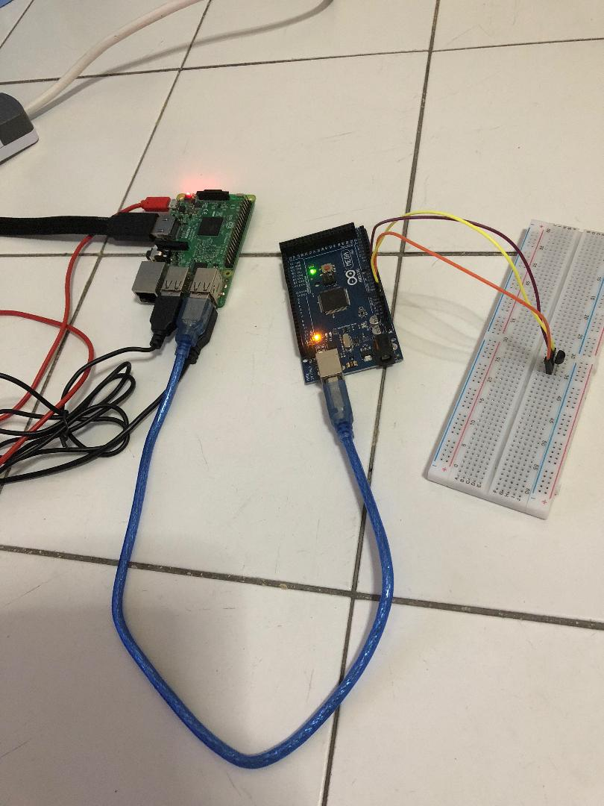
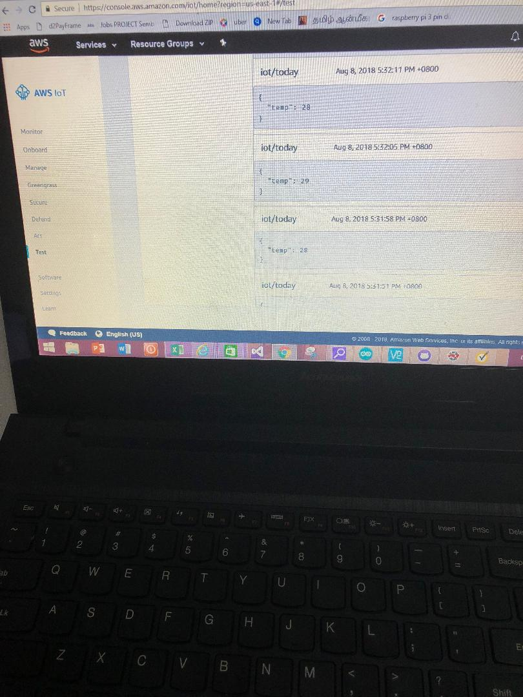

AWS_IOT_SmartFactory_Alert_Maintanence_Team
===========================================

In the Smart factory, Machine 1 comprises Arduino Mega and Raspberry Pi.
Temperature sensor is connected with Arduino and from Arduino, data is serially
transmitted to Raspberry Pi. Here making a communication between Arduino and
Raspberry Pi. Raspberry Pi do not have inbuilt ADC, so one way of connecting
analog sensor to it, is through Arduino.

From Raspberry Pi, data is sent to AWS cloud through MQTT protocol. In AWS, Rule
engine is designed in such a way that, as soon as temperature on machine 1 goes
more than 36, it should send an trigger alert to maintanence team via Email and
SMS.

Requirements:

-   Raspberry Pi

-   Arduino Mega

-   Temperature Sensor – LM35

-   PC, USB Cable and Jump Wires

